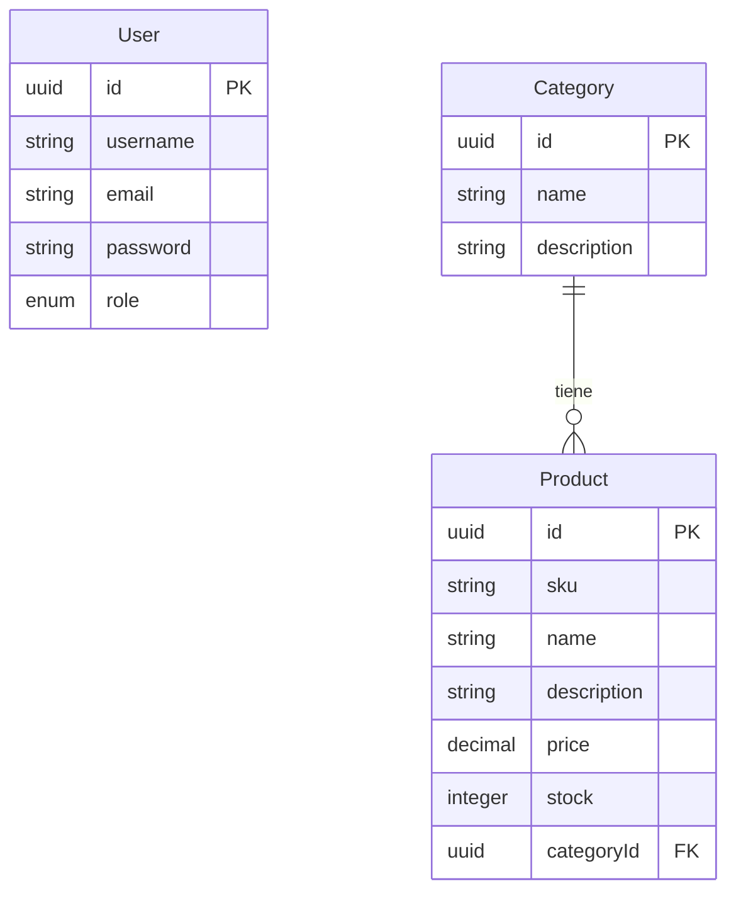

# 📖 Guía de Elaboración y Arquitectura del Proyecto

Esta guía detalla paso a paso el proceso de diseño, desarrollo y arquitectura aplicados para la construcción de la **API de Inventario RESTful** y su **Dashboard**. El objetivo es documentar las decisiones técnicas y metodológicas para facilitar la auditoría del proyecto por reclutadores y colaboradores.

---

## 🛠️ Fase 1: Análisis de Requisitos y Modelo de Datos

El núcleo del sistema es la gestión de un catálogo de productos estructurado y seguro. Se diseñó un modelo de datos relacional compuesto por tres entidades principales utilizando **PostgreSQL**:

### Decisiones de Diseño de Datos:
* **Identificadores Únicos (UUID):** Se prefirieron UUIDs sobre IDs autoincrementales para ocultar la escala de datos al cliente y mejorar la seguridad general de la API.
* **Integridad Referencial:** Se definió la relación entre `Category` y `Product` con la restricción `onDelete: 'RESTRICT'`, lo que impide que se elimine una categoría que aún contenga productos vinculados.

---

## ⚙️ Fase 2: Configuración Inicial y Boilerplate (MVC)

Se implementó el patrón arquitectónico **MVC (Modelo-Vista-Controlador)** en Node.js utilizando **ES Modules (`import/export`)**.

1. **Configuración de Dependencias:** Se inicializó `package.json` con dependencias clave: `express` (servidor), `sequelize` y `pg` (ORM y base de datos), `jsonwebtoken` y `bcryptjs` (seguridad), `swagger-ui-express` (documentación) y `serverless-http` (compatibilidad con la nube).
2. **Conexión Abstraída:** En [config/database.js](file:///c:/Users/Admin/Downloads/API%20de%20Inventario%20RESTful/config/database.js) se configuró un pool de conexiones optimizado para PostgreSQL.

---

## 📂 Fase 3: Capa del Modelo (Model)

Se definieron los esquemas de datos dentro del directorio `models/`:

* **[User.js](file:///c:/Users/Admin/Downloads/API%20de%20Inventario%20RESTful/models/user.js):** Contiene hooks automáticos (`beforeSave`) que interceptan la creación o modificación de usuarios para cifrar la contraseña con **Bcrypt.js** a 10 rondas de salting.
* **[Product.js](file:///c:/Users/Admin/Downloads/API%20de%20Inventario%20RESTful/models/product.js):** Valida a nivel base de datos que el precio y el stock no tomen valores negativos (`validate: { min: 0 }`).
* **[index.js](file:///c:/Users/Admin/Downloads/API%20de%20Inventario%20RESTful/models/index.js):** Centraliza y expone las relaciones `hasMany` y `belongsTo`.

---

## 🛡️ Fase 4: Capa de Seguridad (Autenticación y RBAC)

La seguridad se implementó como middlewares interceptores dentro de [middlewares/authMiddleware.js](file:///c:/Users/Admin/Downloads/API%20de%20Inventario%20RESTful/middlewares/authMiddleware.js):

1. **JWT Verification (`protect`):** Intercepta la cabecera `Authorization: Bearer <token>`, valida su firma, verifica que no haya expirado y carga los datos del usuario en la solicitud (`req.user`).
2. **Role-Based Access Control (`restrictTo`):** Middleware currificado que restringe las acciones de escritura (`POST`, `PUT`, `DELETE`) únicamente a usuarios con el rol `admin`. El personal de almacén (`staff`) solo tiene acceso a las rutas de visualización y al ajuste de stock.

---

## ⚡ Fase 5: Capa de Controladores y Rutas

La lógica de negocio se aisló en los controladores (`controllers/`) y se expuso a través de routers de Express en (`routes/`):

* **Ajuste de Stock Transaccional:** En lugar de permitir modificaciones libres de stock en peticiones `PUT` (lo cual es inseguro para un inventario), se diseñó un endpoint dedicado `POST /products/:id/adjust-stock`. Este controlador calcula la diferencia del stock de manera aislada y lanza un error si la salida excede el stock actual, impidiendo saldos negativos.
* **Manejo Centralizado de Errores:** En [middlewares/errorMiddleware.js](file:///c:/Users/Admin/Downloads/API%20de%20Inventario%20RESTful/middlewares/errorMiddleware.js) se configuró un manejador de excepciones global que traduce errores crípticos de Sequelize en respuestas JSON informativas para el cliente (Ej. "El SKU ya existe").

---

## 📖 Fase 6: Documentación y OpenAPI (Swagger)

Se utilizó **Swagger JSDoc** para mantener la documentación al lado del código de producción. Las rutas en `routes/` contienen metadatos YAML que describen los parámetros de URL, las respuestas esperadas y los esquemas JSON de los datos.

La interfaz de Swagger UI se expone de manera interactiva en la ruta `/api-docs` consumiendo la configuración establecida en [swagger/swaggerConfig.js](file:///c:/Users/Admin/Downloads/API%20de%20Inventario%20RESTful/swagger/swaggerConfig.js).

---

## 💻 Fase 7: Frontend Premium y Modo Demo

Se construyó una aplicación de página única (**SPA**) en [public/index.html](file:///c:/Users/Admin/Downloads/API%20de%20Inventario%20RESTful/public/index.html) con diseño premium e iconos vectoriales estilizados con **Lucide Icons**.

### Arquitectura Híbrida del Frontend:
Para maximizar su utilidad en un portafolio web, se diseñó un switch inteligente:
* **Modo Demo:** Intercepta las operaciones y las escribe/lee de `localStorage`. Los reclutadores pueden simular la API al instante.
* **Modo Live:** Realiza llamadas `fetch` reales al servidor Express, agregando el token JWT recuperado tras iniciar sesión.

---

## ☁️ Fase 8: Arquitectura Serverless (Netlify)

Para hospedar un backend Node.js tradicional en Netlify sin pagar servidores dedicados, se aplicó la técnica de envoltura:
1. **Serverless HTTP:** En [netlify/functions/api.js](file:///c:/Users/Admin/Downloads/API%20de%20Inventario%20RESTful/netlify/functions/api.js) se envuelve la aplicación Express para convertirla en funciones serverless asíncronas.
2. **Redireccionamientos:** En [netlify.toml](file:///c:/Users/Admin/Downloads/API%20de%20Inventario%20RESTful/netlify.toml) se instruye a Netlify a redirigir cualquier consulta web hacia la función Lambda serverless, garantizando que Express gestione las rutas.
